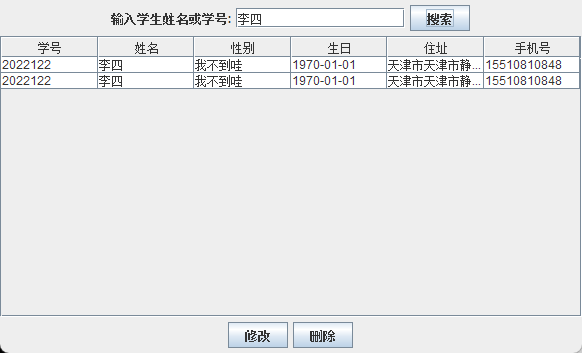
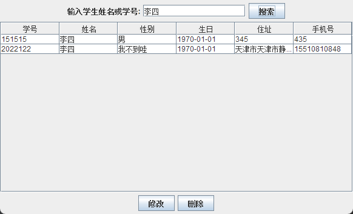

## 数据库设计

- BIGINT 学号（主键）
- STRING 姓名
- STRING 性别
- DATE 生日
- STRING 家庭住址
- STRING 联系电话

电话设置为string类型为处理区号问题

学号设置为主键保证唯一性

## 代码设计

使用javaSwiming MySql进行编写

### gui包

#### MainGUI

##### 本类为主界面，包含添加学生，管理学生，导入学生和导出学生。

其中添加学生操作调用AddStudent类，管理学生操作为调用NewViewStudent类，导入导出操作在本类下完成。

导出操作：导出文件格式为CSV类型，自动导出到软件目录下

导入操作：额外创建出一个文件选择器，来选择导入文件

#### AddStudentGUI

##### 本类为添加学生页面

注意：其中生日输入格式只能为yyyy/DD/mm的格式，若输入格式不符合则使用默认值（1970/01/01)

处理了学号只能为数字的问题，输入错误时弹出窗口提示，并不设默认值进行修改

#### NewViewStudentGUI

##### 本类为学生管理页面，包含搜索和修改学生信息的功能

`搜索功能区`，可以使用学号或姓名进行搜索。在搜索时候，会自动判断输入的是学号还是姓名进行搜索，当有重名学生时，也可正常返回信息

`修改功能区`，选中修改行后点击修改会弹出新的修改窗口，窗口中会填入选中行的数值，便于修改。

其中性别区域，设置成了文本输入框，**`可以自定义性别`**。当修改完成后会自动刷新管理面板的信息

### JDBC包

#### DatabaseConnector

##### 本类为数据库的连接

数据库版本：MySql 5.7

为减少环境问题，本软件使用网络数据库，若无法连接请修改本类，改为本地数据库。

当使用新数据库时，可自动建表

#### StudentDAO

##### 本类作用为后端交互，包含增删查改等方法

本类主要使用PreparedStatement预编译来处理sql语句

使用ResultSet来接受sql返回集，并进行后续操作

### student包

#### Student

##### 学生类，其中额外包含一个修正日期格式的方法

## 代码编写过程中的错误

### 1.插入生日时的异常处理

#### 错误提示

```java
"C:\Program Files\Java\jdk1.8.0_211\bin\java.exe" "-javaagent:C:\Program Files\JetBrains\IntelliJ IDEA 2023.2.3\lib\idea_rt.jar=1978:C:\Program Files\JetBrains\IntelliJ IDEA 2023.2.3\bin" -Dfile.encoding=UTF-8 -classpath "C:\Program Files\Java\jdk1.8.0_211\jre\lib\charsets.jar;C:\Program Files\Java\jdk1.8.0_211\jre\lib\deploy.jar;C:\Program Files\Java\jdk1.8.0_211\jre\lib\ext\access-bridge-64.jar;C:\Program Files\Java\jdk1.8.0_211\jre\lib\ext\cldrdata.jar;C:\Program Files\Java\jdk1.8.0_211\jre\lib\ext\dnsns.jar;C:\Program Files\Java\jdk1.8.0_211\jre\lib\ext\jaccess.jar;C:\Program Files\Java\jdk1.8.0_211\jre\lib\ext\jfxrt.jar;C:\Program Files\Java\jdk1.8.0_211\jre\lib\ext\localedata.jar;C:\Program Files\Java\jdk1.8.0_211\jre\lib\ext\nashorn.jar;C:\Program Files\Java\jdk1.8.0_211\jre\lib\ext\sunec.jar;C:\Program Files\Java\jdk1.8.0_211\jre\lib\ext\sunjce_provider.jar;C:\Program Files\Java\jdk1.8.0_211\jre\lib\ext\sunmscapi.jar;C:\Program Files\Java\jdk1.8.0_211\jre\lib\ext\sunpkcs11.jar;C:\Program Files\Java\jdk1.8.0_211\jre\lib\ext\zipfs.jar;C:\Program Files\Java\jdk1.8.0_211\jre\lib\javaws.jar;C:\Program Files\Java\jdk1.8.0_211\jre\lib\jce.jar;C:\Program Files\Java\jdk1.8.0_211\jre\lib\jfr.jar;C:\Program Files\Java\jdk1.8.0_211\jre\lib\jfxswt.jar;C:\Program Files\Java\jdk1.8.0_211\jre\lib\jsse.jar;C:\Program Files\Java\jdk1.8.0_211\jre\lib\management-agent.jar;C:\Program Files\Java\jdk1.8.0_211\jre\lib\plugin.jar;C:\Program Files\Java\jdk1.8.0_211\jre\lib\resources.jar;C:\Program Files\Java\jdk1.8.0_211\jre\lib\rt.jar;C:\Users\IhaveBB\Desktop\code\bite109\StudentManagementSystem\target\classes;D:\Users\IhaveBB\.m2\repository\mysql\mysql-connector-java\8.0.26\mysql-connector-java-8.0.26.jar;D:\Users\IhaveBB\.m2\repository\com\google\protobuf\protobuf-java\3.11.4\protobuf-java-3.11.4.jar" org.example.AddStudentGUI
com.mysql.cj.jdbc.exceptions.MysqlDataTruncation: Data truncation: Incorrect date value: '1' for column 'birthdate' at row 1
	at com.mysql.cj.jdbc.exceptions.SQLExceptionsMapping.translateException(SQLExceptionsMapping.java:104)
	at com.mysql.cj.jdbc.ClientPreparedStatement.executeInternal(ClientPreparedStatement.java:953)
	at com.mysql.cj.jdbc.ClientPreparedStatement.executeUpdateInternal(ClientPreparedStatement.java:1092)
	at com.mysql.cj.jdbc.ClientPreparedStatement.executeUpdateInternal(ClientPreparedStatement.java:1040)
	at com.mysql.cj.jdbc.ClientPreparedStatement.executeLargeUpdate(ClientPreparedStatement.java:1350)
	at com.mysql.cj.jdbc.ClientPreparedStatement.executeUpdate(ClientPreparedStatement.java:1025)
	at org.example.StudentDAO.addStudent(StudentDAO.java:35)
	at org.example.AddStudentGUI$1.actionPerformed(AddStudentGUI.java:65)
	at javax.swing.AbstractButton.fireActionPerformed(AbstractButton.java:2022)
	at javax.swing.AbstractButton$Handler.actionPerformed(AbstractButton.java:2348)
	at javax.swing.DefaultButtonModel.fireActionPerformed(DefaultButtonModel.java:402)
	at javax.swing.DefaultButtonModel.setPressed(DefaultButtonModel.java:259)
	at javax.swing.plaf.basic.BasicButtonListener.mouseReleased(BasicButtonListener.java:252)
	at java.awt.Component.processMouseEvent(Component.java:6539)
	at javax.swing.JComponent.processMouseEvent(JComponent.java:3324)
	at java.awt.Component.processEvent(Component.java:6304)
	at java.awt.Container.processEvent(Container.java:2239)
	at java.awt.Component.dispatchEventImpl(Component.java:4889)
	at java.awt.Container.dispatchEventImpl(Container.java:2297)
	at java.awt.Component.dispatchEvent(Component.java:4711)
	at java.awt.LightweightDispatcher.retargetMouseEvent(Container.java:4904)
	at java.awt.LightweightDispatcher.processMouseEvent(Container.java:4535)
	at java.awt.LightweightDispatcher.dispatchEvent(Container.java:4476)
	at java.awt.Container.dispatchEventImpl(Container.java:2283)
	at java.awt.Window.dispatchEventImpl(Window.java:2746)
	at java.awt.Component.dispatchEvent(Component.java:4711)
	at java.awt.EventQueue.dispatchEventImpl(EventQueue.java:760)
	at java.awt.EventQueue.access$500(EventQueue.java:97)
	at java.awt.EventQueue$3.run(EventQueue.java:709)
	at java.awt.EventQueue$3.run(EventQueue.java:703)
	at java.security.AccessController.doPrivileged(Native Method)
	at java.security.ProtectionDomain$JavaSecurityAccessImpl.doIntersectionPrivilege(ProtectionDomain.java:74)
	at java.security.ProtectionDomain$JavaSecurityAccessImpl.doIntersectionPrivilege(ProtectionDomain.java:84)
	at java.awt.EventQueue$4.run(EventQueue.java:733)
	at java.awt.EventQueue$4.run(EventQueue.java:731)
	at java.security.AccessController.doPrivileged(Native Method)
	at java.security.ProtectionDomain$JavaSecurityAccessImpl.doIntersectionPrivilege(ProtectionDomain.java:74)
	at java.awt.EventQueue.dispatchEvent(EventQueue.java:730)
	at java.awt.EventDispatchThread.pumpOneEventForFilters(EventDispatchThread.java:205)
	at java.awt.EventDispatchThread.pumpEventsForFilter(EventDispatchThread.java:116)
	at java.awt.EventDispatchThread.pumpEventsForHierarchy(EventDispatchThread.java:105)
	at java.awt.EventDispatchThread.pumpEvents(EventDispatchThread.java:101)
	at java.awt.EventDispatchThread.pumpEvents(EventDispatchThread.java:93)
	at java.awt.EventDispatchThread.run(EventDispatchThread.java:82)

```

#### 问题分析：

在测试时为了方便将所有者数据均输入1，不符合yyyy-MM-dd格式，故出现此错误

错误信息 `Data truncation: Incorrect date value: '1' for column 'birthdate' at row 1` 意味着在尝试插入数据时，`birthdate` 列的日期值 '1' 不符合预期的日期格式或长度，导致数据截断。

#### 解决方案：

**输入时，提示日期格式，并加入异常处理，更改完成后可正常输入日期**

#### 举一反三

**发现学号同样存在问题，原因学号int类型不满足长度需求，故将其改为String类型**

```mysql
ALTER TABLE students MODIFY COLUMN studentId String
```

## 查找时错误

#### 错误信息

- 获取所有学生信息时，获取到的均为同一个学生

- 当多个学生名字相同时，按姓名搜索时获取到的均为同一个学生



#### 问题分析

链表中添加的均为最后一个学生的信息，经过排查是Student类创建的问题

#### 解决方案

```java
while (resultSet.next()){
			Student student = new Student();
			student.setStudentId(resultSet.getLong("studentId"));
			student.setName(resultSet.getString("name"));
			student.setGender(resultSet.getString("gender"));
			student.setBirthdate(resultSet.getString("birthdate"));
			student.setAddress(resultSet.getString("address"));
			student.setPhoneNumber(resultSet.getString("phoneNumber"));
			students.add(student);
		}
```

每次循环重新穿件一个新的student类



#### 后续思考

之前只创建了一个 `Student` 对象，所以在迭代过程中，每次修改它的属性后，链表中所有引用的对象都会进行这些更改。这导致最终链表中的所有元素都是对同一个 `Student` 对象的引用。

在Java中，确实只有值传递，但对于对象来说，传递的是引用的副本，而非对象本身的副本。这意味着当把一个对象传递给方法时，传递的是对该对象引用的副本，而不是对象本身。

总结就是基本数据类型传递的肯定是形参；引用数据类型传递的是地址，形参在方法内被改变，实参也会改变，若在方法内实例化了同名对象，即产生了新的地址，对这个同名对象的改变，由于地址不一样，所以不影响原来的对象
"# StudentManageSystem" 
"# StudentManageSystem" 
